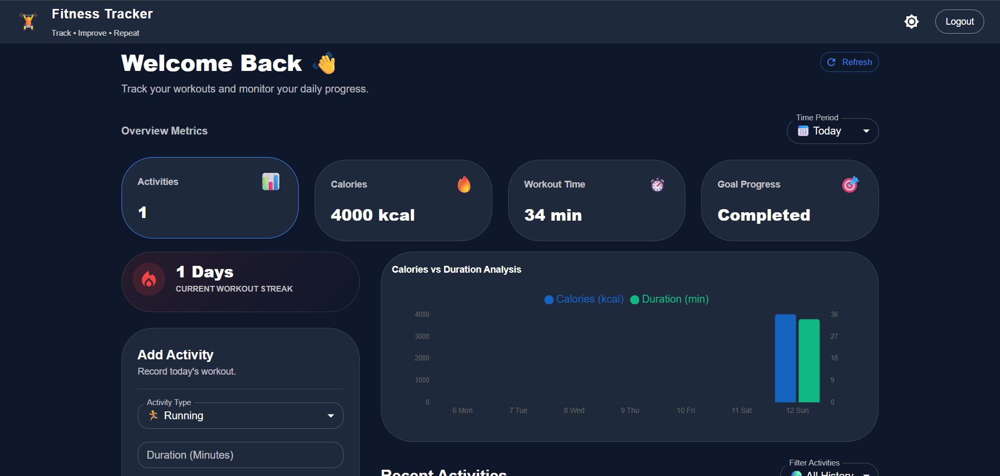
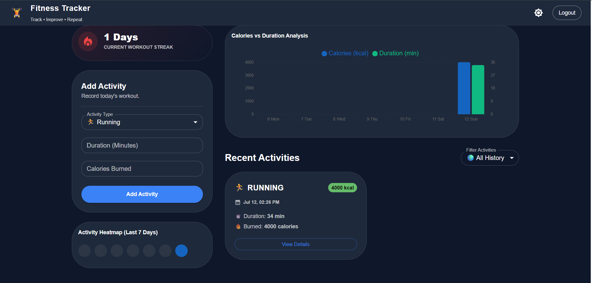
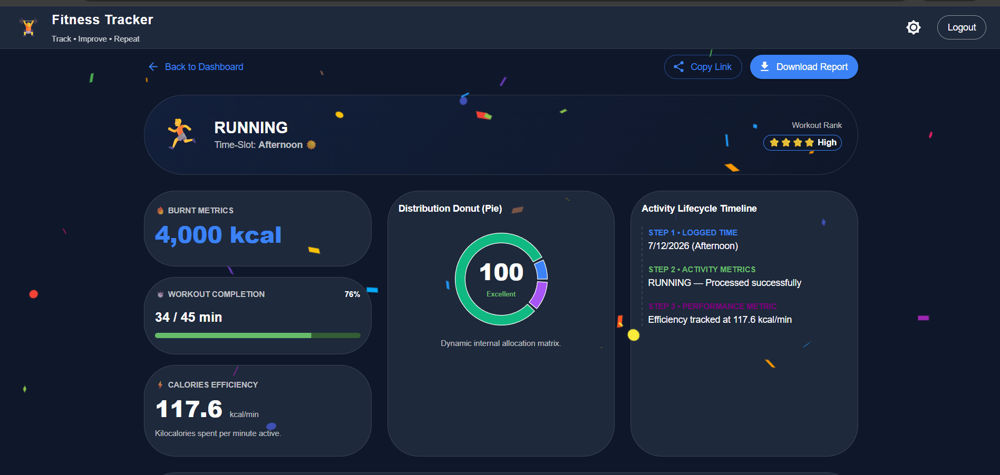
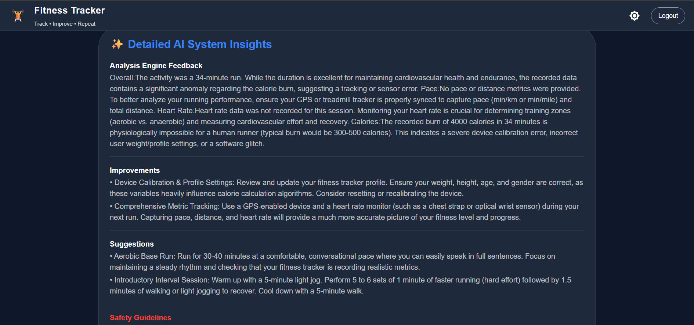

# 🏋️ FitTrack Microservices

<p align="center">


</p>

---

# 📌 Overview

FitTrack Microservices is a cloud-native fitness tracking application developed using **Spring Boot Microservices** and **React**.

The application allows users to securely authenticate using **Keycloak**, record daily fitness activities, visualize workout analytics through an interactive dashboard, and receive AI-powered workout recommendations using asynchronous communication with **RabbitMQ**.

The project follows a distributed microservices architecture where every service is independently deployable and communicates through Spring Cloud components.

---

# ✨ Features

- 🔐 User Authentication using Keycloak
- 🌐 API Gateway
- 📡 Eureka Service Discovery
- ⚙️ Spring Cloud Config Server
- 🏃 Activity Tracking Service
- 🤖 AI Recommendation Service
- 📨 RabbitMQ Event Messaging
- 📊 Interactive Dashboard
- 🔥 Workout Streak Tracking
- 📈 Calories vs Duration Analytics
- 🗓️ Activity Filtering
- 🎨 Responsive React UI
- 🐳 Dockerized Infrastructure
- 💾 MongoDB & PostgreSQL Integration

---

# 🏗️ System Architecture

```
                        +----------------------+
                        |   React Frontend     |
                        +----------+-----------+
                                   |
                            API Gateway
                                   |
                  +----------------+----------------+
                  |                                 |
            Eureka Server                  Config Server
                  |
     +------------+-------------+
     |            |             |
 User Service  Activity Service  AI Service
     |            |             |
 PostgreSQL    MongoDB      RabbitMQ
```

---

# 🛠️ Technology Stack

## Backend

- Java
- Spring Boot
- Spring Cloud
- Spring Security
- Spring Data MongoDB
- Spring Data JPA
- Maven

## Frontend

- React
- Material UI
- Axios
- Recharts

## Databases

- MongoDB
- PostgreSQL

## Authentication

- Keycloak

## Messaging

- RabbitMQ

## DevOps

- Docker
- Docker Compose

---

# 📂 Project Structure

```
FitTrack-Microservices
│
├── activityservice
├── userservice
├── gateway
├── eureka
├── configserver
├── aiservice
└── fitness-app-frontend
```

---

# ⚙️ Microservices

## API Gateway

- Centralized routing
- Authentication forwarding
- Entry point for client requests

---

## Eureka Server

- Service Discovery
- Dynamic service registration

---

## Config Server

- Centralized configuration management

---

## User Service

Responsible for:

- User management
- User information
- Database operations

---

## Activity Service

Responsible for:

- Recording workout activities
- Calories tracking
- Workout duration
- Activity history

---

## AI Recommendation Service

Responsible for:

- Consuming RabbitMQ events
- Generating AI workout recommendations

---

# 📊 Dashboard

The dashboard provides real-time workout analytics including:

- Total Activities
- Calories Burned
- Workout Duration
- Workout Streak
- Weekly Heatmap
- Calories vs Duration Chart
- Recent Activity List
- Activity Filters

---

# 🔐 Authentication

Authentication is implemented using **Keycloak**.

Users are authenticated before accessing protected APIs through the API Gateway.

---

# 📨 RabbitMQ Integration

The Activity Service publishes workout events to RabbitMQ.

The AI Recommendation Service consumes these events and processes workout recommendations asynchronously.

---

# 💾 Database

## PostgreSQL

Stores user-related information.

## MongoDB

Stores activity history and workout records.

---

# 🚀 Getting Started

## Clone Repository

```bash
git clone <repository-url>
```

---

## Start Infrastructure

Run Docker containers for:

- MongoDB
- PostgreSQL
- RabbitMQ
- Keycloak

---

## Run Backend Services

Start services in the following order:

1. Config Server
2. Eureka Server
3. Gateway
4. User Service
5. Activity Service
6. AI Service

---

## Run Frontend

```bash
cd fitness-app-frontend
npm install
npm run dev
```

---

# 📷 Screenshots

## Dashboard



---

## Dashboard Analytics



---

## AI Recommendation



---

## AI Recommendation (Detailed)



---

# 🔮 Future Improvements

- Workout Goals
- Nutrition Tracking
- Push Notifications
- Wearable Device Integration
- Cloud Deployment
- CI/CD Pipeline

---

# 👨‍💻 Author

**Om Pandey**

If you found this project useful, consider giving it a ⭐ on GitHub.